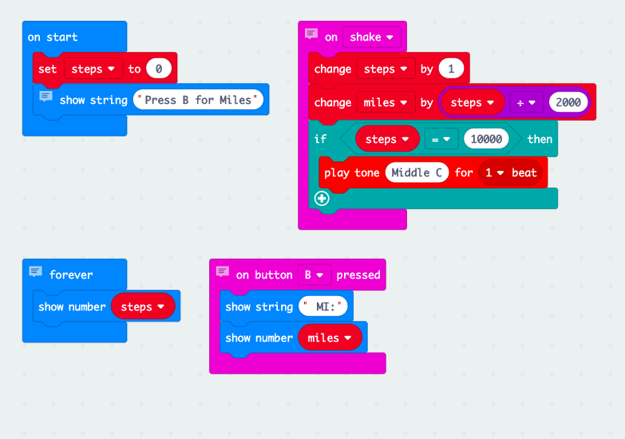

# Internet of Things (IoT)

## Unit 2 Portfolio
Complete collection: [Unit 2 Repository](https://github.com/samcabano/IoT)

#### MicroPython Introduction
   - [MicroPython](https://github.com/samcabano/IoT/blob/master/Micro:bit/microbit.py): Series of MicroPython experiments created by [SparkFun](https://learn.sparkfun.com/tutorials/getting-started-with-micropython-and-the-sparkfun-inventors-kit-for-microbit) to introduce the many functions of the micro:bit.

#### IoT and Networking
   - [Step Counter](https://github.com/samcabano/IoT/blob/master/Choose%20Your%20Adventure/Step_Counter.js): Program that counts steps, displays miles travelled, and plays a tone when 10,000 steps are reached.

## Analysis and Reflection

The internet of things is the foundation of connectivity in modern society. In that, its value is tremendous, as anything can be programmable, generate data, or become automated. To demonstrate this on a micro-scale, the Python Fundamentals course explored the many functions of the mesh network created by micro:bit. By displaying the expansive possibilities of the micro:bit, we are only scratching the surface of IoT. 

By creating a Step Counter, I was able to use existing code from [micro:bit's website](https://microbit.org/en/2018-02-13-iet-lessons-11/) to create a slightly more dynamic program that allows sensory and tactile input, with auditory and visual output. I chose to create and modify a step counter because I found it interesting you can use micro:bit as a working product prototype. Step counters are increasing in popularity, and are the foundation of multi-million dollar companies, such as FitBit. 

To complete this project, I utilized Microsoft's MakeCode For Micro:bit website to produce a JavaScript file:

 

#### Sample Step Counter JavaScript Code:
```javascript
// micro:bit template code increases step by 1 each shake
input.onGesture(Gesture.Shake, function () {
    steps += 1
    miles += steps / 2000
    if (steps == 10000) {  // plays a tone when user reaches 10,000 steps
        music.playTone(262, music.beat(BeatFraction.Whole))
    }
})

// always shows step count
basic.forever(function () {
    basic.showNumber(steps)
})
```

By utilizing technology, there are infinite possibilities for innovation of products and programs that can improve our daily lives, and even our health!

<h3 align="center">
  <a href="https://samcabano.github.io/cabano-profile/">Return to ABOUT ME</a>
</h3>
